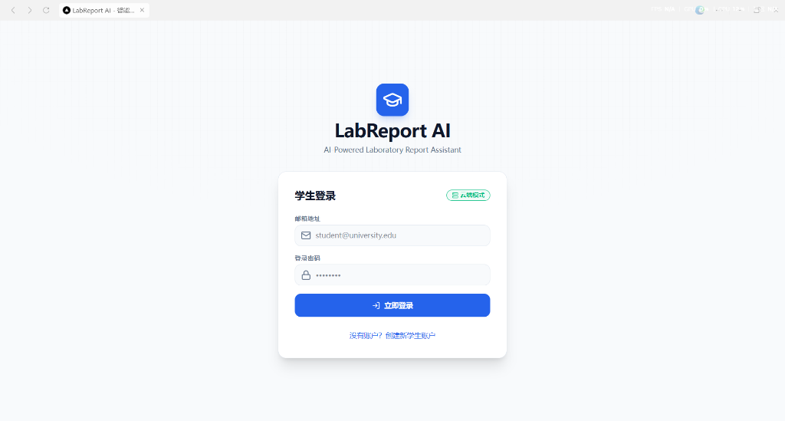
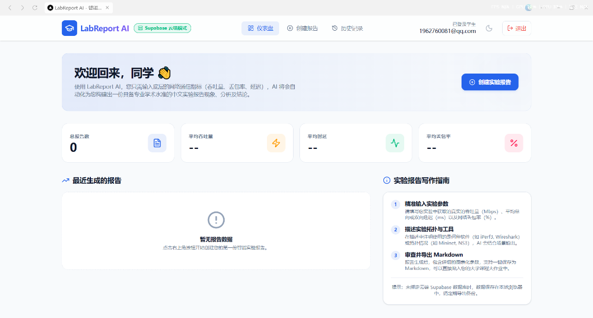
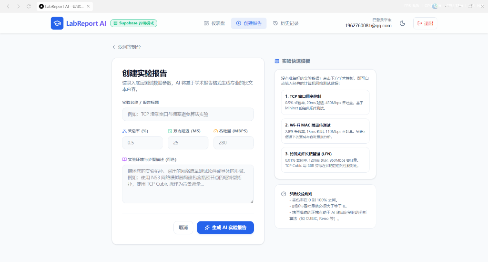
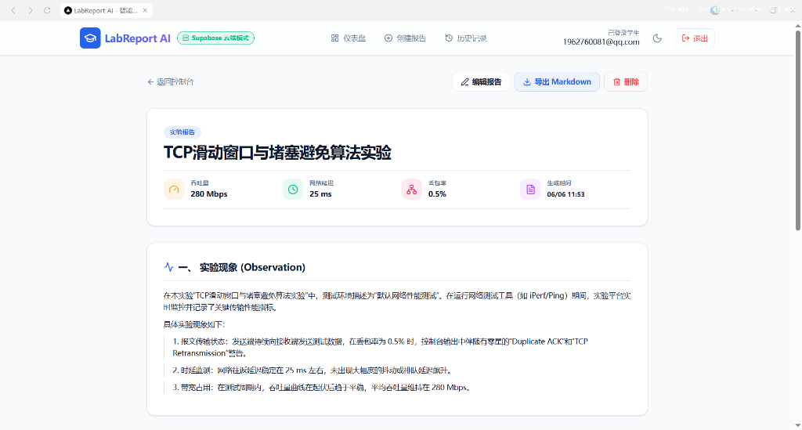
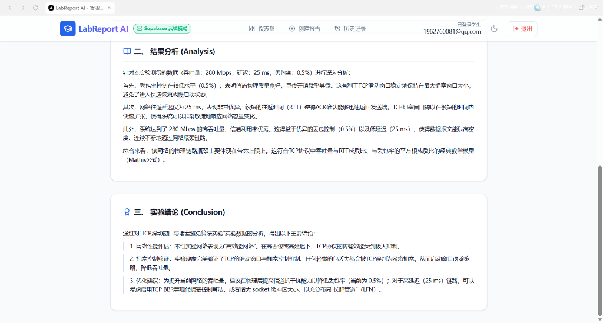

# LabReport AI (智能实验报告助手) 🧪✍️

An AI-powered academic assistant designed for computer science students to generate structured, professional network experiment reports automatically based on raw simulation data (latency, throughput, packet loss).
一款基于 AI 的学术辅助工具，专为计算机专业学生设计，能够根据网络仿真裸数据（延迟、吞吐量、丢包率）自动生成结构化、规范化的实验报告。

---

## 🌟 项目简介 (Introduction)

### 中文
**LabReport AI** 是一款面向计算机与通信专业学生的智能实验报告生成与管理平台。
在计算机网络实验中，学生通常需要花费大量时间将测试工具（如 Ping, iPerf, Wireshark）输出的裸数据转换成合规的实验报告。本系统通过 **AI (Gemini / OpenAI / DeepSeek)** 分析输入的**丢包率、延迟、吞吐量**等关键指标，结合经典网络理论（如 TCP 拥塞控制、Mathis 公式等），一键生成规范的**实验现象描述、结果定量/定性分析与实验结论**。
为了确保演示和使用零门槛，系统支持 **云端数据库模式 (Supabase)** 与 **免配置本地模式 (LocalStorage Fallback)** 智能切换。

### English
**LabReport AI** is an intelligent laboratory report generation and management platform tailored for computer science and telecommunication students.
In typical computer network experiments, students spend hours formatting raw output from testing tools (e.g., Ping, iPerf, Wireshark) into compliant lab reports. This system utilizes **AI (Gemini / OpenAI / DeepSeek)** to analyze key input metrics like **packet loss, latency, and throughput**. By integrating classical network theories (such as TCP congestion control mechanisms and Mathis formula), it generates professional **experiment observations, quantitative/qualitative analysis, and logical conclusions** with one click.
To ensure a zero-setup demo experience, the system supports smart toggling between **Cloud Database Mode (Supabase)** and **Zero-config Local Mode (LocalStorage Fallback)**.

---

## 📸 界面预览 (Screenshots)

### 1. 登录页面 (Login Page)


### 2. 仪表盘 / 控制台 (Dashboard)


### 3. 创建实验报告 (Create Report)


### 4. AI 报告生成详情 - 实验现象 (Report Details - Observations)


### 5. AI 报告生成详情 - 结果分析与结论 (Report Details - Analysis & Conclusion)


---

## ✨ 主要功能 (Key Features)

- 🔐 **双模式身份认证 / Dual-Mode Authentication**
  - **CN**: 支持基于 Supabase Auth 的云端账户系统；若未配置云端，则自动无缝降级到本地缓存模式。
  - **EN**: Supports cloud authentication powered by Supabase Auth; seamlessly falls back to Local Mode if cloud config is not provided.
- 📊 **实验数据输入与预设模板 / Parametric Inputs & Templates**
  - **CN**: 录入实验名称、丢包率、延迟、吞吐量及描述。内置 TCP 拥塞控制、Wi-Fi 衰减、光纤长肥管道 (LFN) 三大学术预设模板。
  - **EN**: Input fields for experiment title, packet loss, latency, throughput, and description. Features three academic presets (TCP Congestion, Wi-Fi Signal Loss, and Optical LFN).
- 🤖 **多 AI 模型驱动引擎 / Multi-Model AI Engine**
  - **CN**: 优先通过 Gemini 1.5 Flash 接口生成精准报告，支持 OpenAI (GPT-4o-mini) 和 DeepSeek API。若未配置任何 API Key，将自动启用本地启发式算法模板生成器。
  - **EN**: Prioritizes Gemini 1.5 Flash API for high-quality reports, with fallback to OpenAI and DeepSeek APIs. Includes a local heuristic template generator if no API keys are configured.
- 📝 **学术级报告生成 / Academic Report Generation**
  - **CN**: 自动输出结构化的“实验现象”、“结果分析”及“实验结论”，深度融合网络协议栈底层机制分析。
  - **EN**: Automatically generates structured "Observation", "Analysis", and "Conclusion" sections, diving deep into protocol-level networking mechanisms.
- 📂 **历史记录与 Markdown 导出 / History & Markdown Export**
  - **CN**: 提供历史报告的模糊搜索、在线编辑、重新生成与删除。支持一键导出标准的 `.md` 学术排版文件。
  - **EN**: Allows fuzzy searching, online editing, regeneration, and deletion of historical reports. Supports exporting to standard `.md` markdown files with one click.
- 🌗 **响应式与多主题 / Responsive & Theme Switching**
  - **CN**: 自适应移动端及平板，支持随系统或手动切换暗黑模式 (Dark Mode)。
  - **EN**: Fully responsive across mobile/tablet views, supporting manual or system dark mode toggling.

---

## 🛠️ 技术栈 (Technology Stack)

| 领域 / Field | 技术 / Technology | 说明 / Note |
| :--- | :--- | :--- |
| **Core Framework** | Next.js 16 (App Router), React 19 | 现代化服务端渲染与高性能路由 / Modern App router |
| **Language** | TypeScript | 类型安全保障 / Type-safety |
| **Styling** | Tailwind CSS v4 | 玻璃拟态与流畅微动画 / Glassmorphism & micro-animations |
| **Icons** | Lucide React | 丰富现代图标 / Aesthetic icon library |
| **Database / Auth** | Supabase (PostgreSQL) | 云端存储与 OAuth 认证 / Cloud database and user session |
| **Fallback** | Browser LocalStorage | 离线免配置模式 / Off-line zero-configuration storage |
| **AI Engine** | Gemini 1.5 / OpenAI / DeepSeek | 结构化 JSON 提示词工程 / Structured JSON Prompt engineering |

---

## 🚀 运行方法 (How to Run)

### 1. 环境准备 (Environment Setup)
在项目根目录下创建一个 `.env.local` 文件（可参考 `.env.example`）：

```bash
# Supabase 配置 (可选，如留空则自动启用离线模式)
NEXT_PUBLIC_SUPABASE_URL=your_supabase_url
NEXT_PUBLIC_SUPABASE_ANON_KEY=your_supabase_anon_key

# AI API Keys (可选，如全部留空则自动启用本地模板生成器)
GEMINI_API_KEY=your_gemini_api_key
OPENAI_API_KEY=your_openai_api_key
DEEPSEEK_API_KEY=your_deepseek_api_key
```

### 2. 安装依赖并启动开发服务器
```bash
# 安装项目依赖
npm install

# 启动本地开发服务 (支持 ExecutionPolicy 绕过)
powershell -ExecutionPolicy Bypass -Command "npm run dev"
# 或者直接运行
npm run dev
```
打开浏览器访问 [http://localhost:3000](http:/ocal/lhost:3000) 即可开始使用。
测试网址  https://lab-report-ai-two.vercel.app/

---

## 🤖 AI 协作记录 (Vibe Coding with AI)

本项目的页面设计、前后端逻辑和 API 错误重试机制均由**学生与 AI 协同开发**完成。
- **AI 辅助设计**：使用 AI 快速生成符合学术界审美（Academic Blue）的 UI 调色板及响应式断点控制。
- **本地降级方案**：AI 协助设计了优雅的 LocalStorage Fallback 方案，使得即使在没有网络连接或数据库失效的情况下，用户也能够完美体验所有功能。
- **结构化 Prompt 开发**：设计了能够迫使 AI 严格以 JSON 格式返回“实验现象、分析、结论”三段式报告的 System Prompt，确保了生成结果的稳定性。

